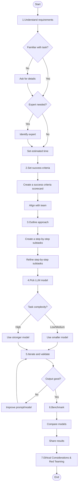

## Why is this important?

Working with AI related tool is different from working with traditional tools. In traditional tools, you have a clear goal and you need to follow a set of steps to achieve the goal, also results are deterministic (for a given input, the output is always the same). With AI, the goal might not be always clear and there is no single path to achieve the goal (there are many LLMs nowadays, each with different capabilities and limitations), therefore the process is iterative and requires much more iterations to find the best solution. This is why it is important to have a mental model of how to work with AI, so you can get the most out of it with the least effort.

## Assumptions

Most projects I've been part of, I collaborated with a product team to define the requirements and the expected results. Therefore the mental model is based on this assumption.

## Development Workflow

### 1. Understand the requirements

As silly as it sounds, you need to understand the requirements of the task before you can start working with AI.
Most of the time, you will be asked to automated a task using AI that you might not be familiar with (e.g. you are not the target audience of the product), this reason it's important for you to have clarity on what the task is, expected results and how it is performed by a human.

**Questions to ask:**

- Is this a task I am familiar with? If no:
  - Ask ask product team for more details. Focus on understanding the workflow and the expected results.
  - Request examples of how the task is performed by a human.
- Is this a task that needs to be performed by an specific expert? If yes:
  - Ask the product team for the expert name (or use a LLM or internet to identify the expert).
  - Ask yourself does this needs a human-in-the-loop?
  - If an expert is not directly available, consider how to access the required specialized knowledge (e.g., documentation, SME interviews).
- What is the estimated time to complete the task at the development level?
  - This will help you to understand the time constraints for you to deliver the task (especially because further steps like iteration and benchmarking will take time to complete).

**Tips:**

- Product team might not have all the details to answer all your questions, that's ok. You can use a LLM to help you understand the task better and validate your understanding with the product team.

### 2. Set clear success criteria

AI is not a magic tool that will solve all your problems, it will only be able to solve problems that are similar to the ones it was trained on. Also, keep in mind that giving the probabilistic nature of LLMs, despite of good your prompt and your model is, you might still receive a bad output and that's ok.

**Questions to ask:**

- How does a good output look like?
- How does a somewhat good output look like?
- How does a bad output look like?
- What is the minimum quality of the output that I can accept?

Using the answers to the questions above, set a success criteria scorecard if possible. This will help you to evaluate the output of the AI. Consider both qualitative and quantitative measures. Examples include: accuracy, relevance, tone, format adherence, latency, cost. **Make sure to align with the product team on the scorecard.**

**Tips:**

- It might not always be possible for the product team to provide a clear answer to the questions above, that's ok. As in other steps, you can use the LLM to help you to come up with the success criteria but make sure to align with them.
- Document examples of good/bad outputs for future reference and team alignment.

### 3. Outline human approach

The more you describe the task, the better the AI will be able to help you. Think how a human would perform the task and describe it in detail as a checklist of steps.

**Questions to ask:**

- What is the first step to perform the task?
- What is next step? how do you know you are done?
- What is the expected output of the task? Check if you need a specific format for the output such JSON, plain text, etc.

**Once you are done with the checklist, think about the following questions:**

- Is this list of steps too complex? Can you break it down into smaller steps?
- Is there any step that is not necessary? Can you remove it?

**Tips:**

- If you feel that the steps are too complex or too long, consider having a separate LLM call or considering picking a strong model before hand that can handle complex tasks.
- If you don't have clarity on how a human would perform the task, ask a LLM to help you.

### 4. Pick a initial LLM model to start with

Based on complexity of the subtasks you have outlined in the previous step (Outline human approach), pick a initial LLM model to start with your experimentation. Keep in mind that some models are more expensive than others and some models are better at handling complex or specific tasks than others. **Seek for a balance between quality and cost.**

**Questions to ask:**

- What is the best model for this task? Can I start with a small model?
- What is the minimum quality of the output that I can accept?
- What is the maximum cost that I can afford for this task?
- How many tokens per input/output will I use?
- Do I need the model to use a tool? (e.g. Agents with retrieval tool)
- Check leaderboards and benchmarks (e.g., for coding, math, reasoning) to see which models perform best for your specific task type.

**Tips**

- In general, [gemini](https://ai.google.dev/gemini-api/docs/pricing) cheap models tend to accept more tokens per input, but lower for output.
- If tasks are medium or low complexity, you can start with a small model and iterate from there (eg: smaller, faster models available at the time).
- For medium and high complexity tasks, you can start with strong models which might include reasoning capabilities (eg: larger, more capable models).
- Some models seem to not work well with tools yet, so you might need to use a different model if tool use is required.

### 5. Iterate and validate against success criteria

Draft your prompt using the model you picked in the previous steps, also set the proper role for the LLM (e.g. `You are a data analyst`, `You are a software engineer`, etc). Use the success criteria scorecard to evaluate the output of the AI. If the output is not good enough, iterate on the prompt or the model. Here some sequential steps you can follow:

1. Iterate on the prompt:

- Ask a strong LLM to help you improve the prompt with clear instructions.
- Use [markdown](https://youtu.be/W6Z0U11nnhA?si=cVxoaA6y32sPM4fR) to structure your prompt. This has higher chance of being read correctly by the LLM.
- If an instruction is constantly ignored, try:
  - Highlight the instruction in the prompt. Use `**` to bold the instruction or prefix the instruction with `You must` or `IMPORTANT:`.
  - Reinforce the instruction in the prompt. Either add it in the beginning of the prompt or in the end. You can use a special section like: `Key Instructions` or `Rules`
- Use [few shot examples](https://www.promptingguide.ai/techniques/fewshot) to help the LLM to understand the task better.
- Convert your prompt to [CoT (Chain of Thought)](https://www.promptingguide.ai/techniques/cot) prompt.

2. Iterate on the model. Check if a stronger model can help you achieve better results.
3. Iterate on model parameters. Adjust parameters like temperature or top-p to influence creativity vs. predictability.
4. Remove any instructions that are not necessary. Tokens has a cost (even small things like whitespaces), so you should remove any instructions that are not necessary but not affecting the output quality nor later maintainability.

**Tips:**

- For the role, aim to use a specific role that is aligned with the task.
- Provide clear, high-quality examples of the desired output directly within the prompt ([few-shot examples](https://www.promptingguide.ai/techniques/fewshot)). This often significantly improves the LLM's understanding and output quality.
- If a model constantly ignores instructions despite of all the improvements, try to use a different model or consider breaking the task into smaller subtasks (and as mentioned before, delegating a specific subtask to a different LLM call could be a good strategy).
- If a prompt involves many complex instructions or subtasks, consider breaking it down. You might get better results by using multiple simpler prompts (potentially sequential calls) rather than one overloaded prompt. Aim for clarity and "one primary instruction" per interaction when possible. This applies the same principle of simplification discussed in Step 3, but during the iteration phase based on observed model performance.
- Iteration with AI is hard. Try to be as organized as possible to track what input was used for which output. In general, you should test one change at a time (isolate variables: change only the prompt, the model, or a parameter in one iteration).
- Use an experimentation framework to track your iterations - a simple spreadsheet with columns for prompt version, model, input, output, and assessment against your criteria can be very effective.
- When you hit a roadblock with a specific instruction, try reformulating it completely rather than just emphasizing it.

### 6. Benchmark and optimize

Once you have a good prompt and the desired output, benchmark it against other models (especially those who has reasoning capabilities). Provide the benchmark results to the product team and ask them to validate the results. Make sure to include the cost or time metrics so a decision can be made on which model to use.

**Tips:**

- Timebox your iterations. Remember that LLMs are always evolving, so you don't need to aim for perfect results now, but you should aim for good results.
- Consider deployment factors like API availability, regional restrictions, and throughput needs when making the final model decision.

### 7. Ethical Considerations & Red Teaming

Before finalizing your solution, consider the ethical implications and potential misuse.

**Questions to ask:**

- Could the AI output be biased? How can we mitigate this?
- Are there potential harms if the AI output is inaccurate or misused?
- Does the application comply with relevant privacy regulations and ethical guidelines?
- How can we test for and prevent harmful or unintended outputs (red teaming)?

**Tips:**

- Proactively test your system with adversarial inputs designed to elicit problematic responses.
- Consult ethical AI frameworks and guidelines relevant to your domain.
- Document your ethical considerations and mitigation strategies.

# Chart

### Practical example

Find it in [mental-model-example.md](./mental-model-example.md)
